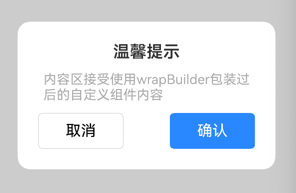
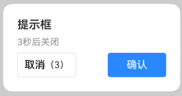

# 📦 DialogUtil 弹窗封装工具（ArkTS）

一个基于鸿蒙 ArkTS 的通用弹窗组件封装，支持灵活配置与自定义插槽，适用于各种场景的弹窗需求，如提示确认、自定义内容展示、延迟关闭等。

---

## 安装

```
ohpm install antd_dialog
```

## 🚀 快速开始

### 一. 初始化 UIContext（**必须**）

1. 在应用入口或当前页面初始化时调用
2. 更建议在 EntryAbility.ets 文件中调用，只需要初始化一次

```ts
import {init} from "antd_dialog"
//1. 在当前页面初始化

 aboutToAppear() {
    init(this.getUIContext()) // 初始化 UIContext，仅在该页面初始化执行一次
  }

//2. 在 EntryAbility.ets 文件中
 onWindowStageCreate(windowStage: window.WindowStage): void {
   ...
    windowStage.loadContent('pages/Index', (err) => {
    if(...){...}
    //注入
      init(windowStage.getMainWindowSync().getUIContext())
      }
  }
```

### 二.打开弹窗

最基础版本



```ts
import { DialogUtil } from "antd_dialog"

@Entry
@Component
struct Index {
  @State message: string = 'Hello World';

  build() {
    Button("打开弹窗").onClick(() => {
      DialogUtil.open()
    })
  }
}
```

可自由传递配置参数

```ts
   
import { DialogUtil } from "antd_dialog"

 Button("打开弹窗").onClick(() => {
      DialogUtil.open({
        title: '温馨提示',
        message: '您确定要退出登录吗？',
        onConfirm: () => {
          console.log('点击了确认')
        },
        onCancel: () => {
          console.log('取消拦截事件')
        },
        btnStyles: {
          BtnYesColor: '#007aff',
          BtnNoColor: '#ffffffff',
          radius: '10px',
          width: "258px",
          height: '130px'
        },
        clickMaskClose: true
      })
    })
```

### 三.关闭弹窗

```ts
DialogUtil.dismiss()
```

### 四.定时关闭弹窗


```ts
Button("显示倒计时弹窗").onClick(() => {
      DialogUtil.setTimeClose() //调用倒计时关闭方法
      DialogUtil.open({
        title: "操作成功",
        message: "3秒后关闭",
        clickMaskClose: false,
        startORend: "start",
        countDown: 3//倒计时显示时间
      })
    })
```

### 五.自定义内容

```ts
@Builder
function
customizeBuilder() {
  Text("我是自定义内容")
}

@Entry
@Component
struct Index {
  customize = wrapBuilder(customizeBuilder) //必须，验证它是一个builder函数
  b = wrapBuilder(timeMinus)
  @State message: string = '我是首页';

  build() {
    Column() {
      Text("我是首页")
      Button("基础弹框").onClick(() => {
        DialogUtil.open({
          title: "提示框",
          clickMaskClose: false, //点击遮罩层是否关闭
          contentBuilder: this.customize, //传入自定义build函数
          startORend: "start", //头、尾部对齐 默认居中
          type: 'prompt',//提示框类型
          btnStyles: {
            radius: '5%',
            BtnYesColor:"#ccc"
          },
          dialogStyles: {
          width: 300
          }
        })
      })
    }
  }
}
```

### 🧩 参数说明（DialogOption）

| 参数              | 类型                 | 说明                                |
|-----------------|--------------------|-----------------------------------|
| title           | string             | 弹窗标题文本                            |
| message         | string             | 弹窗内容文本                            |
| hiddenTitle     | boolean            | 是否隐藏标题                            |
| hiddenMessage   | boolean            | 是否隐藏内容                            |
| hiddenCancelBtn | boolean            | 是否隐藏取消按钮                          |
| startORend      | 'start' \| 'end'   | 标题和内容的对齐方式（start: 左对齐 / end: 右对齐） |
| onCancel        | () => void         | 取消按钮点击回调事件                        |
| onConfirm       | () => void         | 确认按钮点击回调事件                        |
| clickMaskClose  | boolean            | 点击遮罩层是否关闭弹窗                       |
| btnStyles       | BtnStyles          | 按钮颜色、圆角、大小配置                      |
| dialogStyles    | DialogStyles       | 弹窗背景色、圆角、宽高配置                     |
| countDown       | number             | 取消框显示倒计时数字                        |
| contentBuilder  | WrappedBuilder<[]> | 自定义弹窗内容插槽（替换默认的 `message` 内容区域）   |
| closeBuilder    | WrappedBuilder<[]> | 自定义取消按钮尾部插槽（跟随文字"取消"后面）           |
| rightTopBuilder | WrappedBuilder<[]> | 自定义右上角插槽（通常用于关闭按钮或附加功能）           |
| type            | "prompt"           | 简单提示框模式（仅显示一个“确认”按钮，隐藏取消按钮）       |

### 🧱 样式说明

**btnStyles 示例**

```ts
btnStyles: {
  BtnYesColor: '#007aff',
  BtnNoColor: '#f0f0f0',
  radius: '8px',
  width: '280px',
  height: '100px'
}
```

**dialogStyles 示例**

```ts
dialogStyles: {
  backgroundColor: '#ffffff',
  radius: '15px',
  width: '90%',
}
```

### 📌 注意事项

- 打开弹窗前务必调用 init(uiContext) 初始化上下文。推荐在 EntryAbility.ets 初始化，避免重复初始化
- 使用@Builder自定义时，务必使用wrapBuilder()包裹后传递。